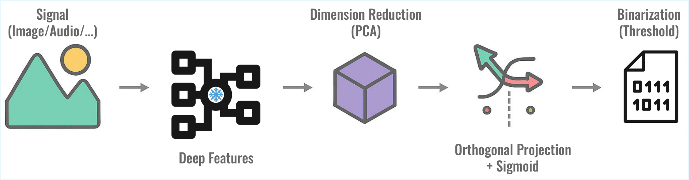
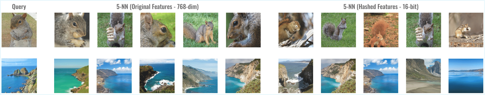

# Hashing-Baseline: Rethinking hashing in the age of pretrained models
[](https://arxiv.org/abs/2509.14427)

## Authors
<sup>1</sup> Ilyass Moummad, <sup>1,2</sup> Kawtar Zaher, <sup>3</sup> Lukas Rauch, <sup>1</sup> Alexis Joly

<sup>1</sup> INRIA, LIRMM, Université de Montpellier, France <br>
<sup>2</sup> Institut National de l’Audiovisuel, France <br>
<sup>3</sup> University of Kassel, Germany 

---

## Retrieval with Hashing Using PCA + Random Orthogonal Projection

This repository implements retrieval systems for **image** and **audio** data based on learned deep features combined with efficient hashing. The hashing technique leverages **PCA + random orthogonal projection** to generate compact binary codes that preserve semantic similarity and enable fast retrieval.

---

## Method Overview



This pipeline extracts deep features from images or audio, compresses them into compact binary codes using PCA and random projection to enable fast similarity search.

1. **Feature Extraction**  
   Deep pre-trained models extract high-dimensional features from images or audio samples.  

2. **Dimensionality Reduction with PCA**  
   Principal Component Analysis (PCA) reduces feature dimensionality while preserving variance and important semantic structure.

3. **Random Orthogonal Projection and Binarization**  
   After PCA, features are projected using a random orthogonal matrix, then binarized using sign function to produce compact binary hash codes.

4. **Retrieval**  
   Retrieval is performed in the Hamming space for fast similarity search.

---

## Retrieval Example

The figure below shows **two query images** and their **5 nearest neighbors** retrieved using:  

- **Original features**  
- **Hashed 16-bit codes**  



This demonstrates that Hashing-Baseline preserves semantic similarity.

---

## Repository Structure

- **`image/`** — Contains code for image retrieval hashing.  
  Supports datasets: `cifar10`, `flickr25k`, and `coco`.  
  Supported models: `dfn` and DINOv2/SimDINOv2 via their checkpoints (`.pth`).  
  See [image/README.md](./image/README.md) for detailed instructions.

- **`audio/`** — Contains code for audio retrieval hashing.  
  Supports datasets: `esc50`, `gtzan`, and `speechcommands`.  
  Supports models: `clap`, `ced`, and `dasheng`.  
  See [audio/README.md](./audio/README.md) for detailed instructions.

---

## Getting Started

1. **Clone the repository**  
   ```bash
   git clone https://github.com/ilyassmoummad/hashing-baseline
   cd hashing-baseline
   ```
2. **Create a Python environment**
   ```bash
   python -m venv envhashingbaseline
   source envhashingbaseline/bin/activate
   python -m pip install -r requirements.txt
   ```
4. Choose your modality folder (`image` or `audio`).
5. Follow the instructions in the README file of the respective folder to download and set up the datasets.
6. Run the provided scripts with your desired model, dataset, and hashing parameters.

---

## References

#### Image Models
- DFN: https://arxiv.org/abs/2309.17425
- DINOv2: https://arxiv.org/abs/2304.07193  
- SimDINOv2: https://arxiv.org/abs/2502.10385  
#### Audio Models
- CLAP: https://arxiv.org/abs/2211.06687  
- CED: https://arxiv.org/abs/2308.11957  
- Dasheng: https://arxiv.org/abs/2406.06992

---

## To cite this work:
```
@misc{hashingbaseline,
      title={Hashing-Baseline: Rethinking Hashing in the Age of Pretrained Models}, 
      author={Ilyass Moummad and Kawtar Zaher and Lukas Rauch and Alexis Joly},
      year={2025},
      eprint={2509.14427},
      archivePrefix={arXiv},
      primaryClass={cs.LG},
      url={https://arxiv.org/abs/2509.14427}, 
}
```